# Quiz Management System

A desktop-based **Quiz Management System** developed using "Python, Tkinter, and SQLite".

This application provides an admin interface for managing quiz questions and student records, conducting quizzes, calculating scores, and viewing quiz results.

---

## Project Overview

The Quiz Management System is a Python-based desktop application designed for educational use.

It allows administrators to securely log in or register, manage questions and students, conduct quizzes, automatically calculate scores, and store quiz results in a SQLite database.

The project follows a modular structure by separating the graphical user interface from database operations.

---

## Features

### Admin Authentication

- Admin Login
- Admin Registration
- Username validation
- Duplicate username prevention
- Strong password validation
- Live password strength indicator
- Password confirmation
- Show/Hide password
- Password hashing
- Logout functionality

### Question Management

- Add questions
- View saved questions
- Update questions
- Delete questions
- Search questions
- Four multiple-choice options
- Correct answer storage

### Student Management

- Add students
- View student records
- Update student information
- Delete students
- Unique roll number validation
- Student name, roll number, and email management

### Quiz System

- Load saved questions
- Display multiple-choice questions
- Select answers
- Navigate through questions
- Automatic answer checking
- Automatic score calculation
- Save quiz results

### Result Management

- Store quiz attempts
- Store student ID
- Store score
- Store total questions
- View quiz results

---

## Technologies Used

| Technology | Purpose |
|---|---|
| Python | Application development |
| Tkinter | Graphical User Interface |
| SQLite | Database management |
| Regular Expressions | Password validation |
| hashlib | Password hashing |

---

## Project Structure

```text
QuizManagementSystem/
│
├── main.py
├── README.md
├── requirements.txt
├── .gitignore
│
├── database/
│   └── database.py
│
├── gui/
│   ├── login.py
│   ├── register.py
│   ├── dashboard.py
│   ├── questions.py
│   ├── students.py
│   ├── quiz.py
│   └── results.py
│
└── screenshots/
    ├── image.png
    ├── image-1.png
    ├── image-2.png
    └── ...
```

> Note: `quiz.db` is used locally by the application and is excluded from the GitHub repository through `.gitignore`.

---

## File Description

### `main.py`

The main entry point of the application.

It starts the application and opens the login interface.

### `database/database.py`

Contains database-related functions for:

- Creating database tables
- Admin registration
- Admin authentication
- Question management
- Student management
- Result management
- Searching questions

### `database/quiz.db`

SQLite database used to store application data locally.

It contains tables for:

- Admins
- Questions
- Students
- Results

### `gui/login.py`

Provides the admin login interface.

### `gui/register.py`

Provides the admin registration interface with:

- Password validation
- Password strength indicator
- Password confirmation
- Show/Hide password
- Password hashing

### `gui/dashboard.py`

Provides the main admin dashboard and navigation to different modules.

### `gui/questions.py`

Handles question management operations including:

- Adding questions
- Updating questions
- Deleting questions
- Viewing questions
- Searching questions

### `gui/students.py`

Handles student management operations including:

- Adding students
- Updating students
- Deleting students
- Viewing students

### `gui/quiz.py`

Handles the quiz process, answer checking, score calculation, and result saving.

### `gui/results.py`

Displays stored quiz results.

---

## Database Design

The application uses SQLite for local database management.

### Admins Table

Stores administrator accounts.

```text
admins
├── id
├── username
└── password
```

### Questions Table

Stores quiz questions and their options.

```text
questions
├── id
├── question
├── option_a
├── option_b
├── option_c
├── option_d
└── correct_answer
```

### Students Table

Stores student information.

```text
students
├── id
├── name
├── roll_number
└── email
```

### Results Table

Stores quiz attempt results.

```text
results
├── id
├── student_id
├── score
└── total_questions
```

---

## Security

The application includes basic authentication and password security features.

### Password Requirements

A password must contain:

- At least 8 characters
- At least one uppercase letter
- At least one lowercase letter
- At least one number
- At least one special character

Example:

```text
Admin@123
```

### Password Hashing

Passwords are hashed before being stored in the database using Python's `hashlib` library and SHA-256 hashing.

This prevents passwords from being stored directly as readable text.

> Note: For production-level applications, dedicated password-hashing algorithms such as Argon2, bcrypt, scrypt, or PBKDF2 are recommended.

---

## Application Flow

```text
                    ┌───────────────┐
                    │   Login Page  │
                    └───────┬───────┘
                            │
                  ┌─────────┴─────────┐
                  │                   │
               Login             Registration
                  │                   │
                  └─────────┬─────────┘
                            │
                    ┌───────▼───────┐
                    │   Dashboard   │
                    └───────┬───────┘
                            │
          ┌─────────────────┼─────────────────┐
          │                 │                 │
     Questions          Students            Quiz
          │                 │                 │
          │                 │                 ▼
          │                 │              Results
          │                 │
          └─────────────────┴─────────────────┘
                            │
                         Logout
```

---

## Installation

### 1. Clone the Repository

```bash
git clone https://github.com/taqdeesfatima-ds/QuizManagementSystem.git
```

### 2. Open the Project Folder

```bash
cd QuizManagementSystem
```

### 3. Check Python Version

Make sure Python 3 is installed.

```bash
python --version
```

The project was developed using:

```text
Python 3.12+
```

### 4. Install Dependencies

The project mainly uses Python's standard library.

```bash
pip install -r requirements.txt
```

Tkinter and SQLite are included with standard Python installations.

### 5. Run the Application

```bash
python main.py
```

---

## Initial Admin Account

For the initial local project setup:

```text
Username: admin
Password: admin123
```

> This account is intended for the initial local setup. Admin registration is also available through the application.

---

## Testing Checklist

### Authentication

- [x] Admin login
- [x] Invalid username validation
- [x] Invalid password validation
- [x] Admin registration
- [x] Duplicate username validation
- [x] Strong password validation
- [x] Live password strength indicator
- [x] Password confirmation
- [x] Show/Hide password
- [x] Password hashing
- [x] Logout

### Question Management

- [x] Add question
- [x] View saved questions
- [x] Update question
- [x] Delete question
- [x] Search questions
- [x] Store four multiple-choice options
- [x] Store correct answer

### Student Management

- [x] Add student
- [x] View student records
- [x] Update student information
- [x] Delete student
- [x] Unique roll number validation
- [x] Store student name
- [x] Store roll number
- [x] Store email

### Quiz System

- [x] Load saved questions
- [x] Display multiple-choice questions
- [x] Select answers
- [x] Navigate through questions
- [x] Check selected answers
- [x] Calculate score automatically
- [x] Save quiz results

### Result Management

- [x] Store quiz attempts
- [x] Store student ID
- [x] Store score
- [x] Store total questions
- [x] Display quiz results

---

## Screenshots

### Admin Login

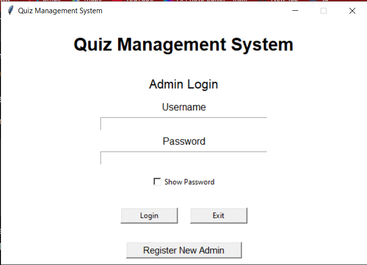

### Admin Registration

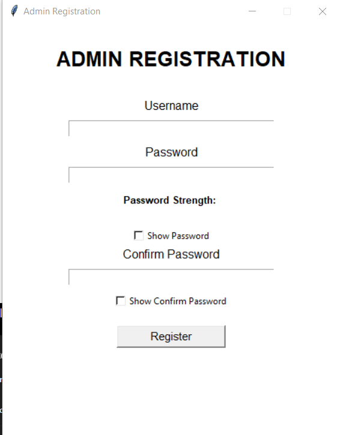

### Password Strength Indicator

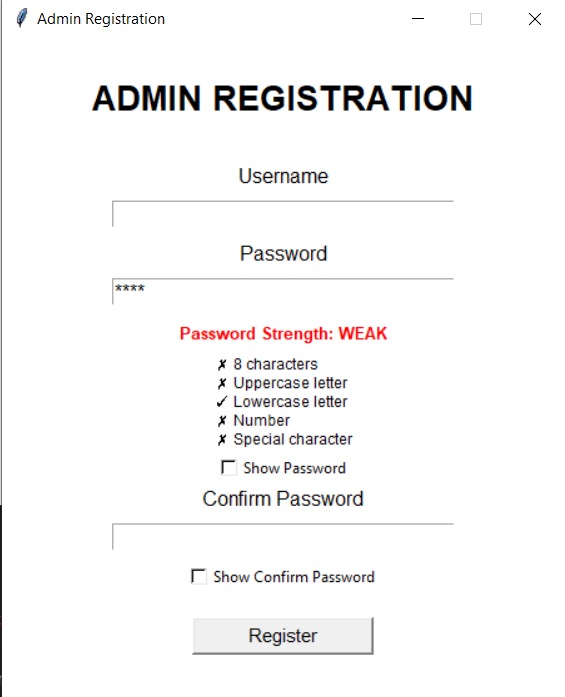

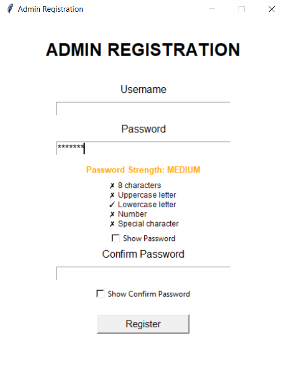

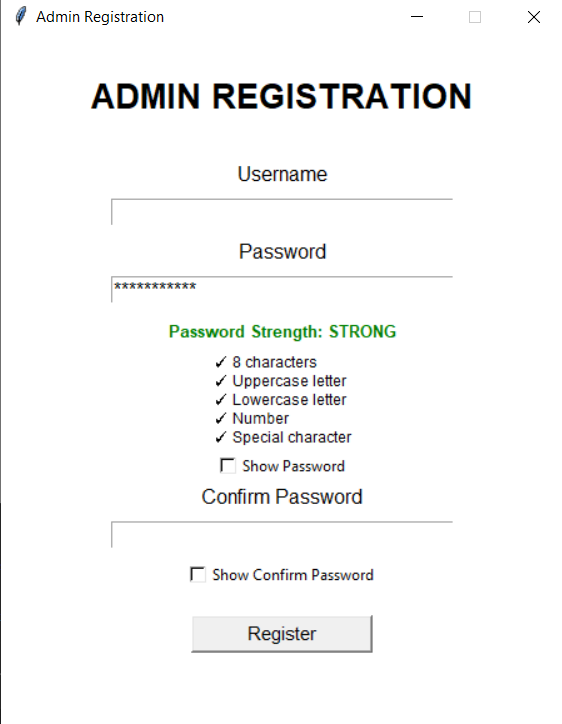

### Admin Dashboard

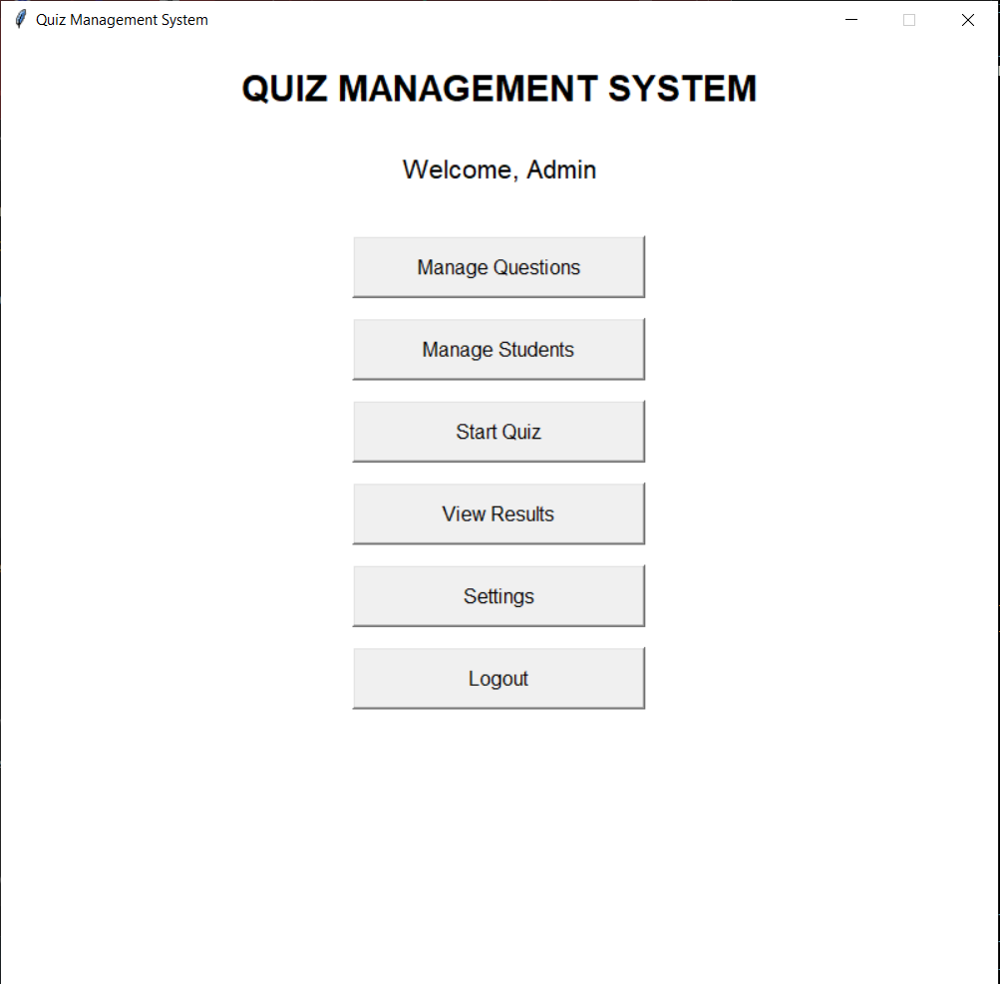

### Question Management

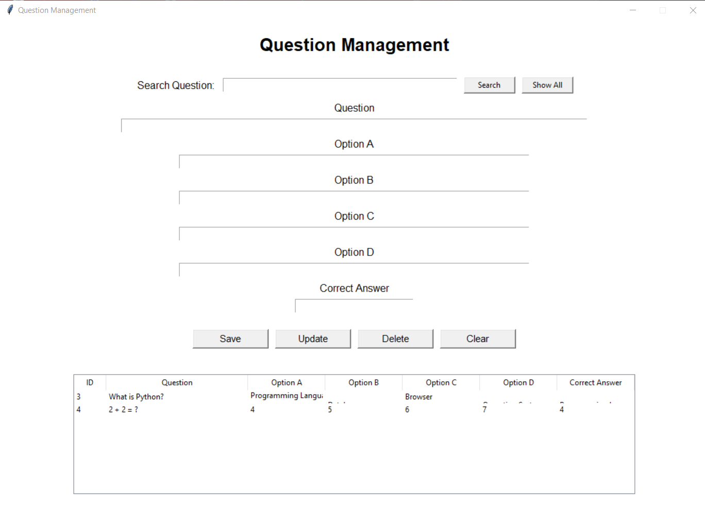

### Student Management

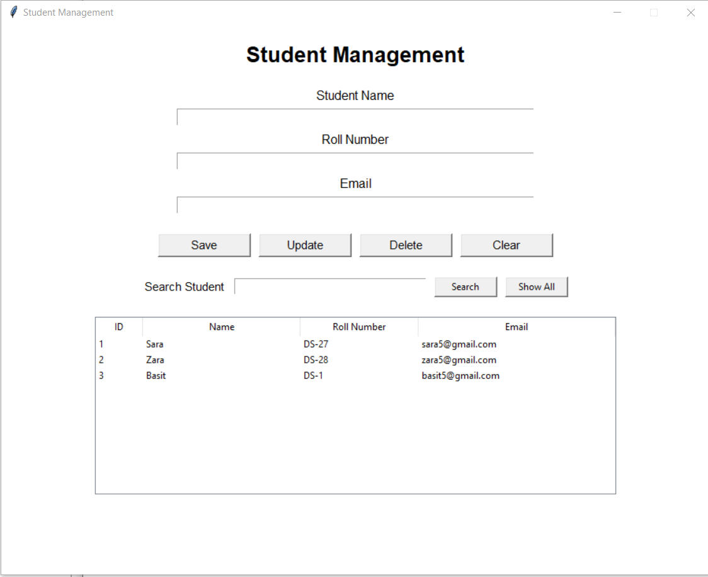

### Quiz

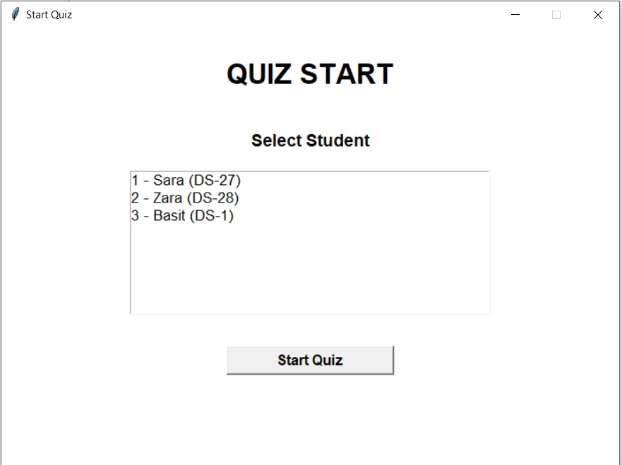

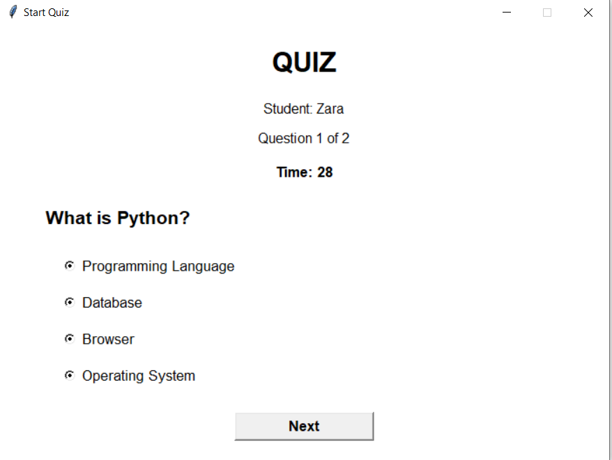

### Results

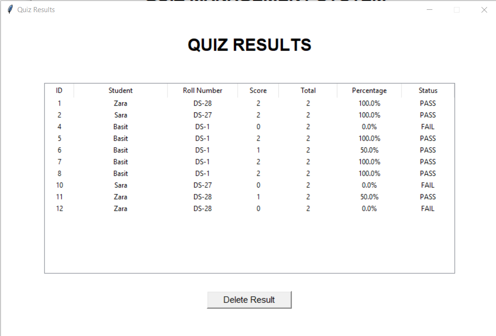

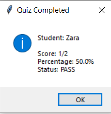

---

## Future Improvements

The following features can be added in future versions:

- Student login system
- Student registration
- Admin profile management
- Password reset functionality
- Quiz timer
- Random question selection
- Quiz categories
- Difficulty levels
- Question import/export
- Result filtering
- Result search
- Result charts and analytics
- PDF result reports
- Improved UI themes
- Role-based access control
- Dedicated password-hashing algorithm
- Standalone executable application

---

## Learning Objectives

This project demonstrates practical implementation of:

- Python programming
- Object-Oriented Programming
- Tkinter GUI development
- SQLite database management
- CRUD operations
- SQL queries
- Exception handling
- Regular expressions
- Password validation
- Password hashing
- Event-driven programming
- Modular programming
- Database integration
- Desktop application development

---

## Project Purpose

This project was developed as a practical Python application to combine programming concepts with a real-world desktop application.

It demonstrates how Python can be used to build a complete application with:

```text
GUI
+
Authentication
+
Database
+
CRUD Operations
+
Quiz System
+
Result Management
```

---

## Author

"Taqdees Fatima"

BS Data Science Student

### Technical Skills

- Python
- Data Analysis
- Pandas
- NumPy
- Matplotlib
- Seaborn
- SQL
- SQLite
- Tkinter
- Object-Oriented Programming
- Database Management

---

## Project Status

"Status: Completed and Functional"

The core functionality of the Quiz Management System has been implemented and tested.

---

## License

This project is developed for educational and learning purposes.

You are free to use and modify the source code for learning and personal projects.